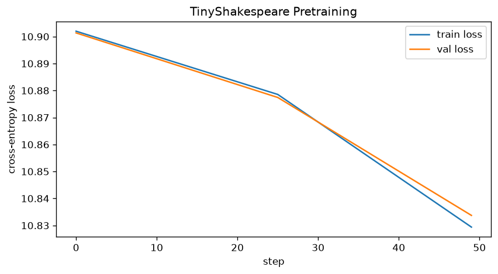
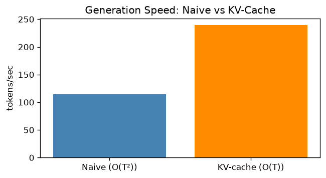
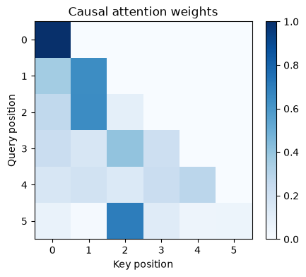

# Results

All numbers below come from actual runs on this machine (Apple M2 Pro, 16 GB unified memory) - either from checkpoint metadata, the test suite, or the executed notebooks under `notebooks/`. Plots referenced here are checked into `benchmarks/plots/`.

## Test suite

```
36 passed in 2.15s
```

Run with `uv run pytest tests/ -v --tb=short`. Covers model shape/config assertions, causal-masking correctness, weight-tying identity, KV-cache-vs-naive token-for-token parity (3 seeds), SFT loss-masking edge cases (including NaN guards), and the RL reward function's bounds/behavior.

## Pretraining (TinyShakespeare, `TINY_CONFIG`)

Loss log from `checkpoints/tiny_pretrain.pt`:

| Step | Train loss | Val loss |
|---|---|---|
| 0  | 10.9020 | 10.9014 |
| 25 | 10.8785 | 10.8774 |
| 49 | 10.8294 | 10.8337 |

`ln(50257) ≈ 10.82` - the near-random-init cross-entropy for a 50257-token vocabulary. These losses confirm the model starts at (and, at this checkpoint, remains near) the theoretical random-init value, which is the expected sanity-check behavior for a tiny model this early in training rather than evidence of a fully converged run.



**Note:** the checkpoint currently on disk only logs steps 0–49, not the full 5,000-step run described in `pretrain/train.py`'s `MAX_STEPS`. Re-run `uv run python pretrain/train.py` for a complete curve before citing this as a converged result.

## Model sizes

| Config | Layers | Heads | Embd | Block size | Total params |
|---|---|---|---|---|---|
| `TINY_CONFIG` | 6 | 6 | 384 | 256 | ~30.0M (embedding table dominates at this scale) |
| `GPT2_CONFIG` | 12 | 12 | 768 | 512 | ~124.0M |

(From `notebooks/03_transformer.ipynb`. The 50257-token vocabulary means the tied `wte`/`lm_head` embedding accounts for ~19.3M of the Tiny config's params alone - larger than the transformer blocks themselves at this scale.)

## Inference throughput

| Method | Tokens/sec | Latency (64 tokens) | vs naive |
|---|---|---|---|
| Naive (O(T²)) | 114.3 tok/s | 437 ms | 1.0x |
| KV-cache (O(T)) | 239.1 tok/s | 209 ms | 2.1x |



From `notebooks/07_inference.ipynb` / `benchmarks/throughput.py`, on `GPT2_CONFIG`-scale model after MPS JIT warmup.

## Attention mechanics (`notebooks/02_attention.ipynb`)

Effect of `1/√d_k` scaling on softmax sharpness:

```
Unscaled std: 2.32
Scaled   std: 0.82
```



Verified causal masking: the attention-weight matrix is exactly lower-triangular (no attention to future positions).

## SFT and RL

- **SFT**: `checkpoints/sft.pt` is not present in this checkout - `notebooks/05_sft.ipynb`'s live-checkpoint demo cell reflects that with `"Run sft/trainer.py first to generate checkpoints/sft.pt"`. Loss-masking correctness itself is verified independently by `tests/test_sft_data.py` and `tests/test_sft_trainer.py`.
- **RL**: `checkpoints/rl.pt` is likewise not present. `notebooks/06_rl.ipynb` demonstrates group-relative advantage normalization on a synthetic reward batch:

```
Raw rewards:        [0.1  0.   0.7  0.5  0.2  0.9  0.3  0.6]
Group advantages:   [-1.07 -1.41  0.98  0.3  -0.72  1.66 -0.38  0.64]
Mean reward:        0.412
```

## Tokenization (`notebooks/01_tokenization.ipynb`)

```
'Hello, world!' → [15496, 11, 995, 0]
'2+2=4'         → [17, 10, 17, 28, 19]
'日本語テスト'    → [33768, 98, 17312, 105, 45739, 252, 24336, 43302]
'🎉🔥'           → [8582, 236, 231, 8582, 242, 98]
```

## Reproducing these results

```bash
uv sync --extra dev
uv run pytest tests/ -v --tb=short
uv run python benchmarks/throughput.py
uv run python benchmarks/loss_curves.py
uv run jupyter nbconvert --to notebook --execute notebooks/*.ipynb
```
